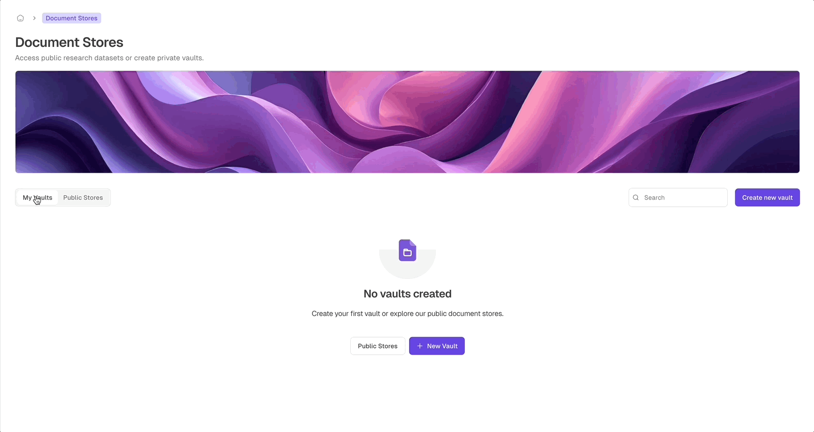
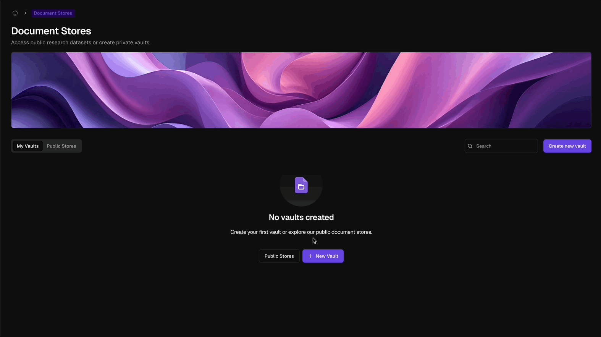

## Turn Documents Into Searchable Knowledge

Document Stores are searchable knowledge vaults for your organisation. Upload or sync files, extract structured metadata with AI, search across content and columns, and make trusted source material available to workflows and AI employees.

<Frame>
  
  
</Frame>

<CardGroup cols={2}>
  <Card title="Searchable Knowledge Vaults" icon="database">
    Store document collections as governed knowledge bases with table views, metadata, and search.
  </Card>
  <Card title="AI-Extracted Metadata" icon="wand-magic-sparkles">
    Define columns such as dates, parties, values, owners, deadlines, or summaries and let AI fill them from each document.
  </Card>
  <Card title="Cloud Folder Sync" icon="cloud-arrow-down">
    Connect Google Drive or OneDrive folders so documents can be imported and kept up to date.
  </Card>
  <Card title="Workforce Ready" icon="user-gear">
    Add stores to AI employees as Knowledge capabilities so they can retrieve the right context during work.
  </Card>
</CardGroup>

## What Document Stores Are For

Use a Document Store when you want a governed collection of files to become searchable, structured, and useful to automation.

Common use cases include:

- Contract and agreement libraries
- Invoices, purchase orders, and receipts
- Policies, procedures, and compliance records
- Legal filings and matter documents
- HR records and employment documents
- Project documentation and status reports
- Training, insurance, medical, tax, and financial records

## Store Library

The Document Stores home page has two views:

| View | What it contains |
| --- | --- |
| **My Vaults** | Private stores created by your organisation. These can be opened, managed, and connected to workers. |
| **Public Stores** | Shared public datasets or resources that can be browsed when available. |

You can search stores by name, subtitle, or description, and create a new private vault from the library.

## How Document Stores Work

<Steps>
  <Step title="Create and configure the vault">
    Name the store, optionally connect sync sources, define metadata columns, and choose the AI model used for extraction.
  </Step>
  <Step title="Add documents">
    Upload files manually, drag and drop into the table, or import documents from connected Google Drive or OneDrive folders.
  </Step>
  <Step title="Review extracted metadata">
    AI fills the columns you defined. Use the table to sort, filter, search, export, and review processing status.
  </Step>
  <Step title="Connect to workers and workflows">
    Add stores to AI employees as Knowledge capabilities or use them in workflows for retrieval, review, drafting, and comparison.
  </Step>
</Steps>

## Learn More

<CardGroup cols={3}>
  <Card title="Create and configure stores" href="/documents/create-and-configure">
    Set up a vault, define metadata columns, choose an AI model, and connect sync sources.
  </Card>
  <Card title="Manage documents" href="/documents/manage-documents">
    Upload files, search the table, preview documents, export metadata, and perform bulk actions.
  </Card>
  <Card title="Settings and integrations" href="/documents/settings-and-integrations">
    Manage schema changes, sync connections, AI model settings, deletion, workforce access, and workflow integration.
  </Card>
</CardGroup>

<Callout type="tip" emoji="💡">
  Use Document Stores for reusable, governed source material. Use a worker's Workspace for temporary files, drafts, and task-specific uploads.
</Callout>