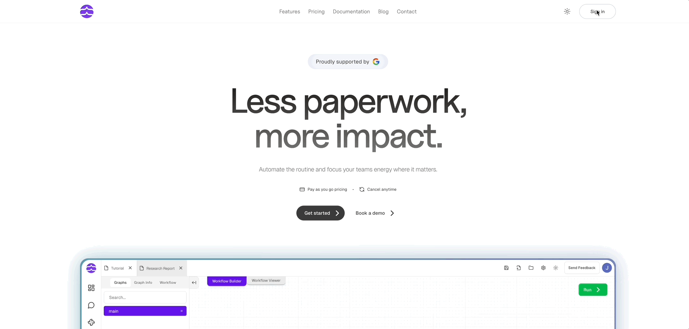
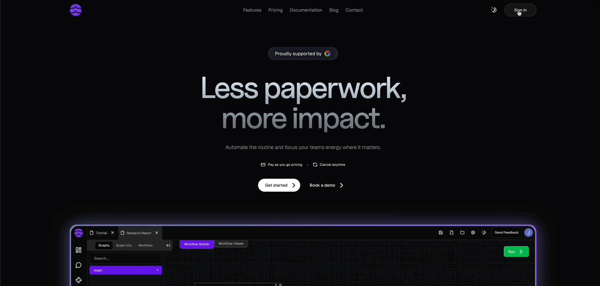
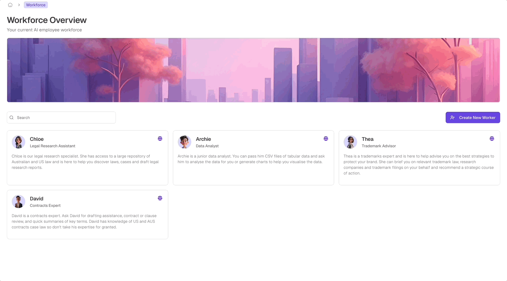
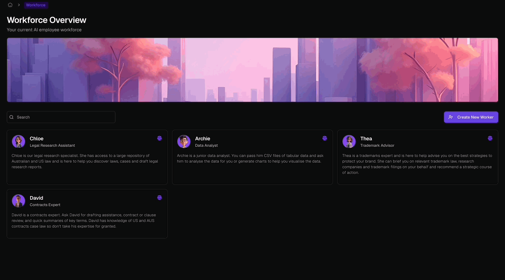

## Step 1: Create Your Account

<Frame>
  
  
</Frame>

<Steps>
  <Step title="Choose Your Sign-Up Method">
    - Click "Continue with Google" or "Continue with Microsoft" for instant access
    - Or use your email: Enter your name and email address
  </Step>
  <Step title="Verify Your Email">
    Check your inbox (including spam) for a verification link and click it
  </Step>
  <Step title="Complete Your Profile">
    Answer a few questions to tailor Odella to your needs
  </Step>
</Steps>

## Step 2: Meet Your Virtual Legal Team

<Frame>
  
  
</Frame>

After signing in, you'll see the **Workforce Overview** page. Here's your 24/7 virtual legal team:

<CardGroup cols={2}>
  <Card title="Thea" icon="trademark" color="#4A90E2">
    Trademark Attorney: Manages AUS & US trademark filings and drafts briefs
  </Card>
  <Card title="Chloe" icon="magnifying-glass" color="#50E3C2">
    Legal Research Assistant: Specializes in cross-jurisdictional research
  </Card>
  <Card title="David" icon="file-contract" color="#F5A623">
    Contracts Expert: Drafts and reviews contracts, summarizing key points
  </Card>
  <Card title="Archie" icon="chart-line" color="#BD10E0">
    Data Analyst: Analyzes data and creates charts for insights
  </Card>
</CardGroup>

## Step 3: Supercharge Your Practice

Now that you're set up, here's how Odella can revolutionize your legal work:

<CardGroup cols={2}>
  <Card title="Free Up Your Lawyers" icon="gavel">
    Virtual team handles routine tasks, allowing lawyers to focus on strategy
  </Card>
  <Card title="Boost Efficiency" icon="rocket">
    Seamlessly integrate automated workflows into your processes
  </Card>
  <Card title="Enhance Research" icon="book-open">
    Use AI-powered document stores for quick, comprehensive legal data
  </Card>
  <Card title="Secure Your Data" icon="shield-check">
    Top-tier encryption and access controls protect your information
  </Card>
  <Card title="AI-Powered Precision" icon="robot">
    Tap into our extensive legal database for compliant, efficient workflows
  </Card>
</CardGroup>

## What's Next?

<Card title="Meet Your Workforce" icon="users" href="/product/workforce">
  Get to know your AI-powered virtual legal team and their specialized capabilities
</Card>

<Card title="Explore Workflows" icon="diagram-project" href="/workflow/overview">
  Learn how to create and manage automated legal workflows
</Card>

<Note>
  Need help? Our support team is always here to assist. [Contact us](mailto:support@odella.ai) anytime!
</Note>
