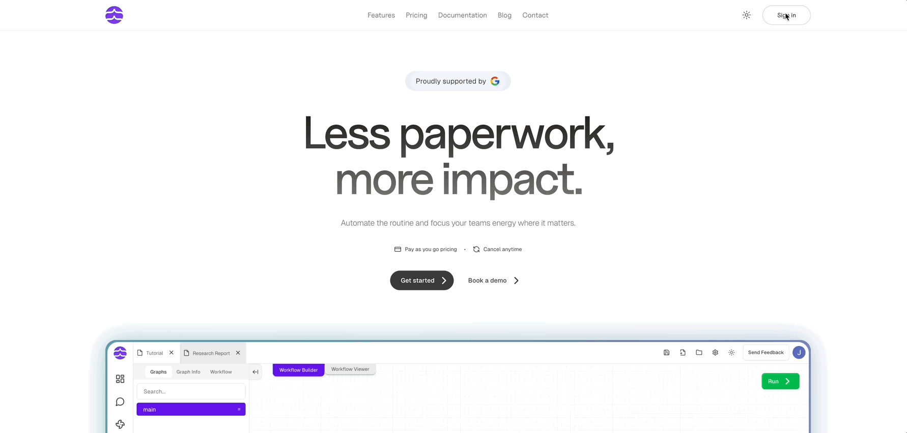
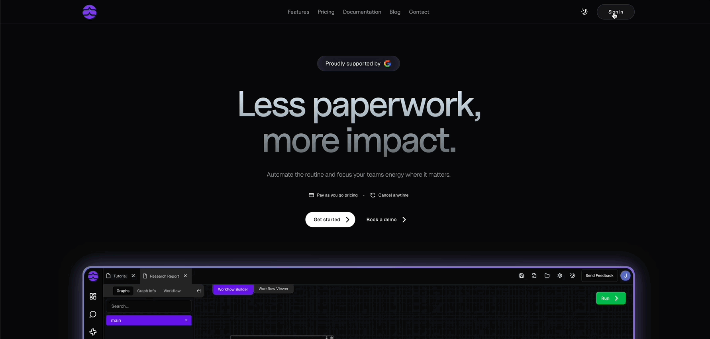
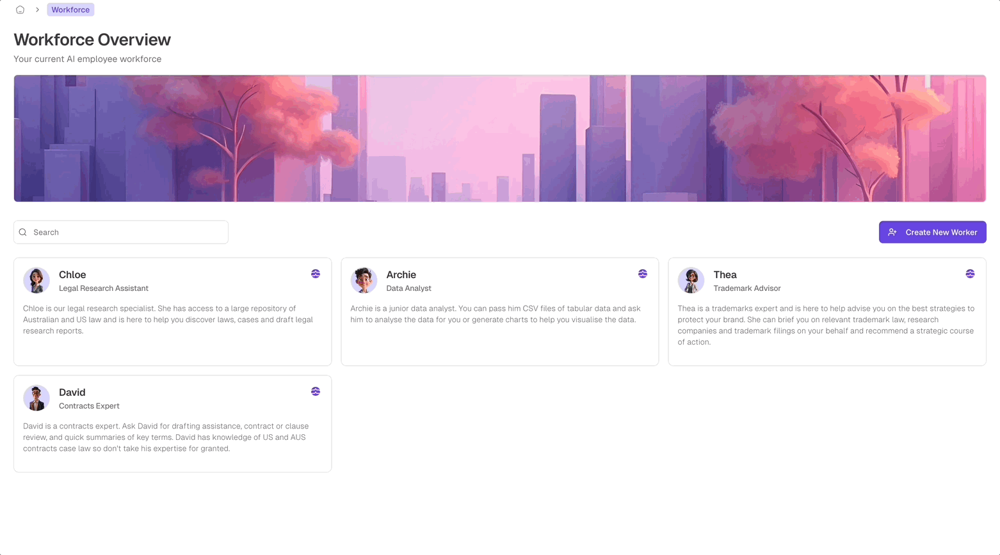
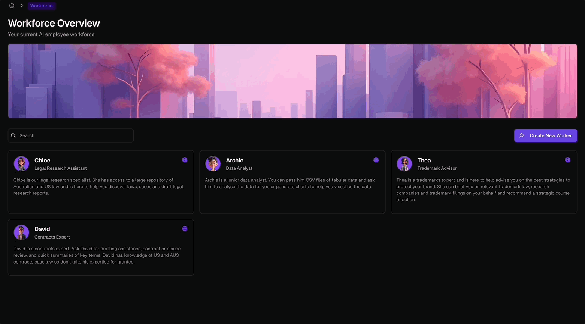

# Quickstart

This guide takes you from a new account to your first practical Odella setup. The goal is not to automate everything at once. Start with one worker, one responsibility, and one repeatable task your team already understands.

## 1. Create your account

<Frame>
  
  
</Frame>

<Steps>
  <Step title="Sign in with your work account">
    Use Google, Microsoft, or email to create your Odella account.
  </Step>
  <Step title="Verify your email">
    Confirm your email address so your workspace can be created securely.
  </Step>
  <Step title="Complete your workspace details">
    Add basic information about your organization so Odella can tailor the workspace to your team.
  </Step>
</Steps>

## 2. Understand the workspace

After signing in, Odella opens to the workforce area. This is where you create and manage the workers that make up your AI workforce.

<Frame>
  
  
</Frame>

<CardGroup cols={2}>
  <Card title="Workforce" icon="users" href="/workforce/overview">
    Create, hire, and manage AI Employees with clear roles, responsibilities, tools, and work history.
  </Card>
  <Card title="Workflows" icon="diagram-project" href="/workflow/overview">
    Build reusable processes that workers can run when completing assigned tasks.
  </Card>
  <Card title="Templates" icon="file-lines" href="/templates/01_overview">
    Turn recurring documents into reusable PDF or DOCX templates.
  </Card>
  <Card title="Documents" icon="database" href="/documents/overview">
    Store files, research, and private knowledge that workers can reference.
  </Card>
</CardGroup>

## 3. Choose your first use case

Pick a process that is clear, repeatable, and easy to review. Good first use cases usually have a known input, a known output, and a person who can check the result.

<AccordionGroup>
  <Accordion title="Good first use cases">
    - Preparing a recurring report from source documents
    - Summarising intake information into a structured format
    - Drafting a document from an approved template
    - Checking a file for missing information
    - Routing a request to the correct person or workflow
  </Accordion>
  <Accordion title="Use cases to save for later">
    - Processes with unclear ownership
    - Work with no review criteria
    - High-risk decisions without human approval
    - One-off tasks that do not repeat often
  </Accordion>
</AccordionGroup>

## 4. Create or hire a worker

In Odella, workers are most useful when they have a narrow role and clear responsibilities.

<Steps>
  <Step title="Open Workforce">
    Go to **Workforce** and choose **Add Worker**.
  </Step>
  <Step title="Define the role">
    Give the worker a plain-language role such as “Intake Assistant”, “Report Reviewer”, or “Finance Admin Worker”.
  </Step>
  <Step title="Add responsibilities">
    Describe what the worker should do, what it should avoid, and when a human should review the output.
  </Step>
  <Step title="Connect capabilities">
    Attach the workflows, templates, documents, and tools the worker needs to complete the task.
  </Step>
</Steps>

<Tip>
  A strong first worker has one job. You can always expand its responsibilities after your team trusts the workflow.
</Tip>

## 5. Connect the work system

A useful worker usually needs three things:

<CardGroup cols={3}>
  <Card title="Knowledge" icon="book-open">
    The policies, files, examples, and business context it should use.
  </Card>
  <Card title="Workflow" icon="route">
    The repeatable process it should follow from input to output.
  </Card>
  <Card title="Review" icon="clipboard-check">
    The human checkpoint that confirms the work is correct before it matters.
  </Card>
</CardGroup>

## 6. Run, review, and improve

Once the worker is configured, run the task on a real but low-risk example. Review the result, update the worker's instructions, and improve the workflow until the output is consistent.

<Note>
  Odella works best when treated like onboarding a new teammate: start with context, assign a narrow responsibility, review early work, then increase trust over time.
</Note>

## Next steps

<CardGroup cols={2}>
  <Card title="Workforce overview" icon="users" href="/workforce/overview">
    Learn how workers are managed across roles, capabilities, working hours, and work history.
  </Card>
  <Card title="Workflow overview" icon="diagram-project" href="/workflow/overview">
    Learn how to build and maintain the workflows your workers use.
  </Card>
  <Card title="Template overview" icon="file-lines" href="/templates/01_overview">
    Learn how templates help your team create consistent documents quickly.
  </Card>
  <Card title="Security" icon="shield-halved" href="/platform/security">
    Review the controls that help keep your workspace governed and secure.
  </Card>
</CardGroup>
