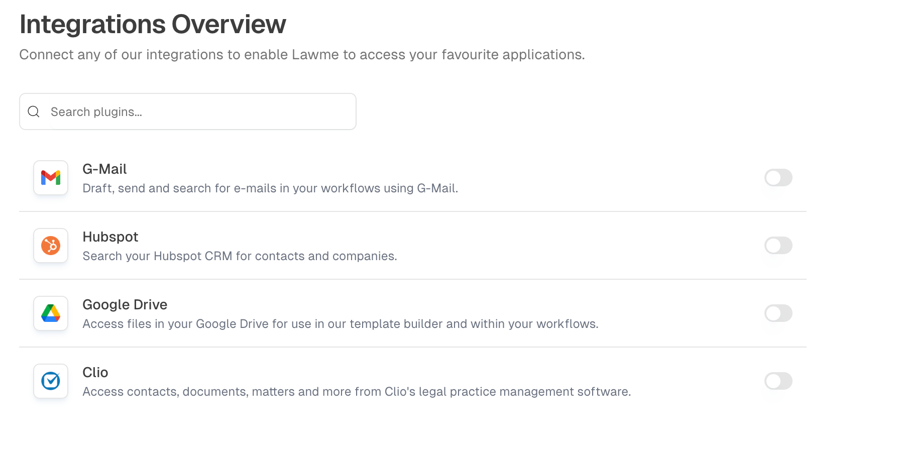
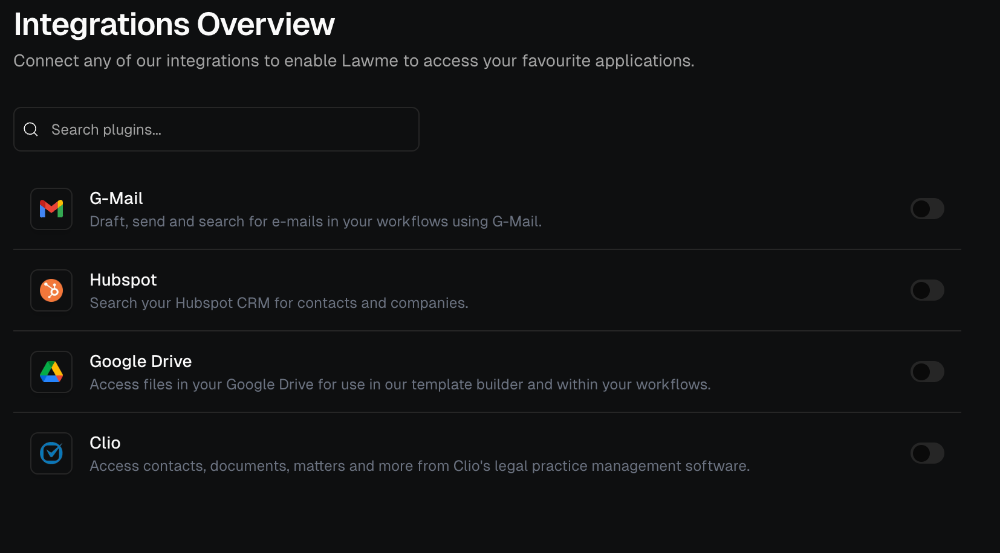

# Integrations

Integrations connect Odella to the tools your team already uses. They let workers access the systems, files, and actions needed to complete assigned tasks without forcing your team to change where work happens.

## Why integrations matter

A worker becomes more useful when it can work with real business context. Integrations help Odella connect to document stores, communication tools, business systems, databases, and APIs.

<Frame>
  
  
</Frame>

<CardGroup cols={2}>
  <Card title="Work where your data lives" icon="folder-open">
    Connect workers to the systems that hold the information they need.
  </Card>
  <Card title="Reduce manual handoff" icon="arrows-rotate">
    Let workflows move information between tools instead of relying on copy-paste work.
  </Card>
  <Card title="Keep access intentional" icon="user-lock">
    Give workers only the integrations that support their role and responsibilities.
  </Card>
  <Card title="Support repeatable processes" icon="diagram-project">
    Use integrations inside workflows so the same process can run consistently every time.
  </Card>
</CardGroup>

## Set up an integration

<Steps>
  <Step title="Open integration settings">
    Go to your workspace settings and open **Integrations**.
  </Step>
  <Step title="Choose the tool to connect">
    Select the service your team wants Odella to use.
  </Step>
  <Step title="Authenticate securely">
    Follow the connection flow for the selected service. This may use OAuth, an API key, or another supported method.
  </Step>
  <Step title="Assign access deliberately">
    Connect the integration to the workers or workflows that need it. Avoid giving broad access when a narrow connection is enough.
  </Step>
  <Step title="Test with a safe example">
    Run a low-risk task to confirm the integration behaves as expected before using it in production work.
  </Step>
</Steps>

## Integration design tips

<AccordionGroup>
  <Accordion title="Start with the task, not the tool">
    Decide what the worker needs to accomplish first. Then connect only the tools required for that responsibility.
  </Accordion>
  <Accordion title="Keep permissions narrow">
    Limit access to the minimum required scope. A worker that drafts documents does not necessarily need access to every system in your workspace.
  </Accordion>
  <Accordion title="Add review for external actions">
    If an integration can send messages, update records, or trigger downstream work, consider adding a human review step before the action is completed.
  </Accordion>
</AccordionGroup>

<Note>
  If your team needs a specific integration that is not available yet, contact [support@odella.ai](mailto:support@odella.ai) with the tool name and the workflow you want to support.
</Note>

## Related docs

<CardGroup cols={2}>
  <Card title="Security" icon="shield-halved" href="/platform/security">
    Learn how integrations fit into workspace governance.
  </Card>
  <Card title="Workflows" icon="diagram-project" href="/workflow/overview">
    Learn how integrations are used inside repeatable processes.
  </Card>
</CardGroup>
