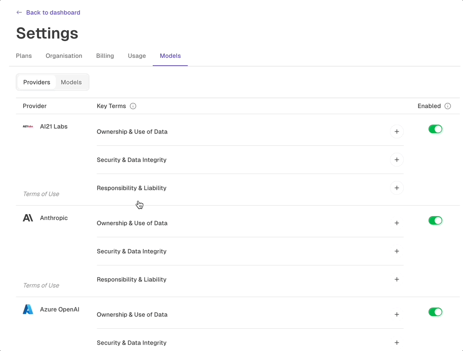
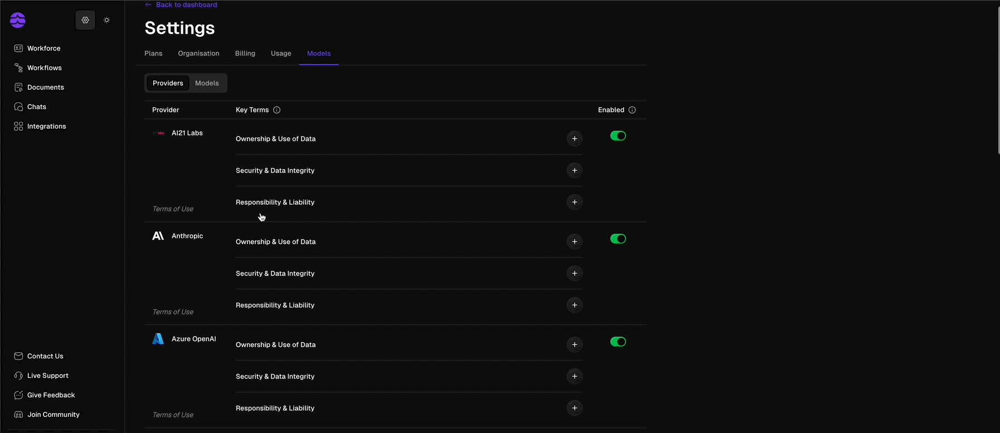

# Models

Odella can connect to leading AI model providers so workers can use the right capability for the work they are assigned. Most teams do not need to manage model details day to day, but workspace-level model settings help administrators align Odella with security, quality, and compliance requirements.

<Note>
  In customer-facing work, think of models as one part of how an AI Employee performs its role. The worker's responsibilities, knowledge, tools, and review process are just as important.
</Note>

## How models fit into Odella

<Frame>
  
  
</Frame>

<CardGroup cols={2}>
  <Card title="Workspace control" icon="sliders">
    Choose which model providers are available to your organization.
  </Card>
  <Card title="Task fit" icon="list-check">
    Use appropriate model capabilities for drafting, extraction, reasoning, summarisation, and review tasks.
  </Card>
  <Card title="Governance" icon="shield-check">
    Align model usage with internal security, privacy, and client requirements.
  </Card>
  <Card title="Future flexibility" icon="refresh-cw">
    Keep your workflows and workers adaptable as model capabilities improve over time.
  </Card>
</CardGroup>

## Recommended approach

<Steps>
  <Step title="Set workspace defaults">
    Decide which model providers are approved for your organization.
  </Step>
  <Step title="Match models to responsibilities">
    Consider the type of work a worker performs: reading, drafting, extracting, analysing, or reviewing.
  </Step>
  <Step title="Test with real examples">
    Run representative tasks and review output quality before assigning the worker broader responsibilities.
  </Step>
  <Step title="Review periodically">
    Revisit model settings as your team's requirements, risk profile, and available model capabilities change.
  </Step>
</Steps>

## What to focus on first

For most teams, the most important model decisions are practical:

- Which providers are allowed in the workspace?
- Which workers handle sensitive information?
- Which workflows need higher accuracy or stronger review?
- Which outputs require human approval before use?

<Tip>
  Do not start by optimizing every model choice. Start by defining the worker's role, responsibility, knowledge, and review process. Then adjust model settings where the work requires it.
</Tip>

## Related docs

<CardGroup cols={2}>
  <Card title="Security" icon="shield-halved" href="/platform/security">
    Review governance and access controls for your workspace.
  </Card>
  <Card title="Workflow data types" icon="code" href="/workflow/data-types">
    Learn how information moves through workflows.
  </Card>
</CardGroup>
