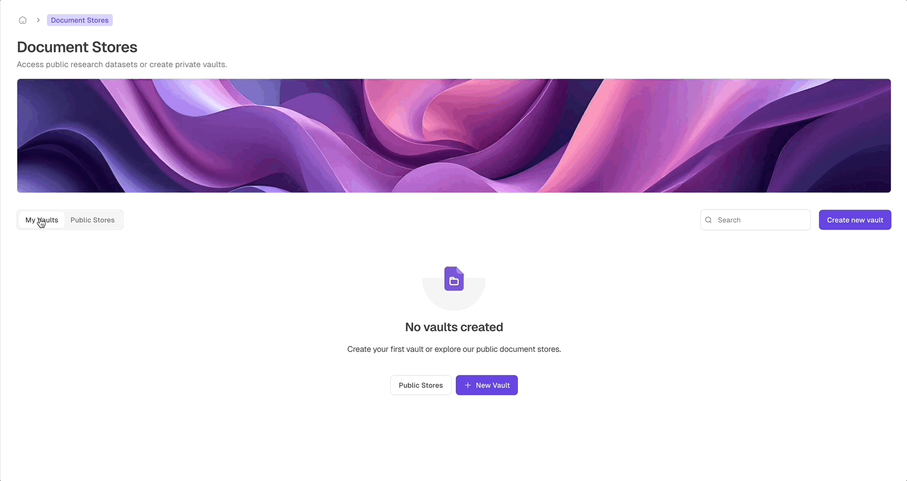
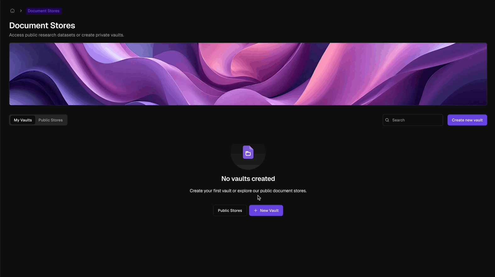

 

The Document Store is an intelligent document management system designed to revolutionise how professionals organise, access, and utilise their documents. It's an intuitive platform that not only stores your files but also enhances your ability to work with them effectively, even if you're not tech-savvy.

<Frame>
  
  
</Frame>

## Key Features of the Document Store

<CardGroup cols={2}>
  <Card title="AI-Powered Knowledge Management" icon="brain-circuit">
    Harness your organisation's collective expertise with AI-driven organisation and retrieval, boosting decision-making and productivity.
  </Card>
  <Card title="Intelligent Information Extraction" icon="file-magnifying-glass">
    Our AI automatically identifies and extracts crucial information from documents, creating a searchable database of key insights.
  </Card>
  <Card title="Seamless AI Assistant Integration" icon="robot">
    Empower AI assistants with relevant document collections to enhance their capabilities and accuracy.
  </Card>
  <Card title="Centralized Secure Storage" icon="database-lock">
    Store all your organisation's documents in one secure, easily accessible location for streamlined operations and enhanced collaboration.
  </Card>
</CardGroup>

## How the Document Store Elevates Your Work

<CardGroup cols={3}>
  <Card title="Comprehensive Resources" icon="scale-balanced">
    Access an extensive, AI-curated library of information, continuously updated with the latest relevant data.
  </Card>
  <Card title="Secure Private Vaults & Public Stores" icon="vault">
    Choose between creating encrypted, private vaults for confidential documents or using public stores to access shared resources. Private vaults ensure privacy and regulatory compliance.
  </Card>
  <Card title="Seamless Workflow Integration" icon="diagram-project">
    The Document Store integrates seamlessly with other features, creating a cohesive ecosystem for your processes.
  </Card>
</CardGroup>

## Setting Up Your AI-Powered Document Store

<Frame>
  
  
</Frame>

<Steps>
  <Step title="Create a Secure Vault">
    Begin by navigating to the Document Store tab and selecting "Create New Vault." In this step, provide essential details:
    
    - **Name**: Give your document store a clear, descriptive name.
    - **Subtitle**: Add a brief subtitle for additional context.
    - **Description**: Describe the purpose of this store and the types of documents it will contain, helping users understand its intended use.

    Once these fields are completed, click "Next Step" to proceed with configuring your vault.
  </Step>
  <Step title="Choose an AI Model">
    Select one of four available AI models, each with unique capabilities and pricing, to process and analyse your documents in the way that best suits your needs.
  </Step>
  <Step title="Define Document Store Columns">
    Customize the fields that will be extracted from your documents. Choose from an existing template or create a custom column structure from scratch. 
    <Note>
      Once columns are created, they cannot be modified. Plan your column structure carefully.
    </Note>
  </Step>
  <Step title="Add and Manage Documents">
    After setting up your columns, upload documents to the vault. The system will automatically extract information based on your column setup, enabling easy retrieval and management of document metadata.
  </Step>
</Steps>

  <Tip>
  Once your vault is set up, you can integrate it with your workflows. This integration allows AI to access and utilise relevant information as needed, enhancing its utility in your daily processes.
  </Tip>

## AI-Powered Document Analysis Capabilities

The Document Store goes beyond simple storage, leveraging advanced AI to provide valuable insights:

<CardGroup cols={2}>
  <Card title="AI-Driven Information Extraction" icon="wand-magic-sparkles">
    Our AI automatically identifies and extracts critical details from your documents, creating a searchable knowledge base.
  </Card>
  <Card title="Advanced Language Processing" icon="microchip-ai">
    Cutting-edge natural language processing technology interprets complex terminology and concepts within documents.
  </Card>
</CardGroup>

### Types of AI-Extracted Information

<CardGroup cols={2}>
  <Card title="Comprehensive Document Metadata">
    AI-generated information including creation date, author, revision history, and document relationships.
  </Card>
  <Card title="In-Depth Context">
    AI-identified relevant references or precedents mentioned in the document, with links to source material.
  </Card>
  <Card title="Intelligent Document Structure Analysis">
    AI-powered breakdown of document organisation and layout, facilitating navigation of complex texts.
  </Card>
  <Card title="Critical Concept Identification">
    AI-highlighted important principles, obligations, and conditions within the document for quick reference.
  </Card>
</CardGroup>

### Benefits of AI-Powered Document Analysis

- Dramatically accelerated document review processes
- Enhanced compliance management through AI-assisted monitoring
- Automation of routine tasks, freeing up valuable time

The Document Store is designed to amplify your expertise by providing AI-driven, organised, and insightful document management. It's a powerful tool that complements your professional skills and streamlines your workflows.

<Tip>
  While the AI-powered Document Store offers advanced features to enhance your work, it's crucial to remember that it's a tool to augment your expertise, not replace your professional judgment. Your domain knowledge remains indispensable in interpreting and applying the AI-generated insights.
</Tip>
