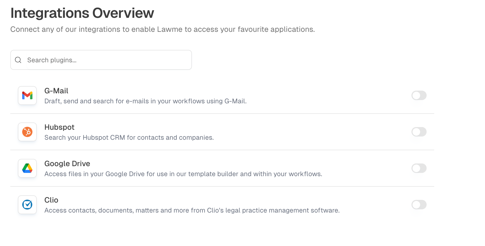
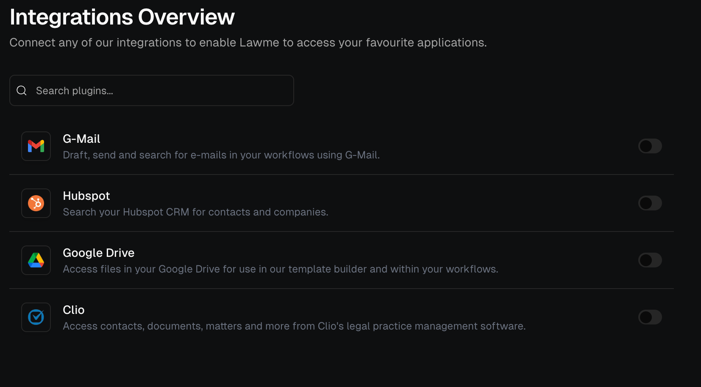

 

Odella integrates seamlessly with a wide range of tools and services to enhance your legal workflow capabilities. Our integration ecosystem allows you to connect with the platforms you already use, making your transition to AI-powered legal work smooth and efficient.

## Available Integrations
<Frame>
  
  
</Frame>

<Steps>
  <Step title="Access Integration Settings">
    Navigate to the Settings panel and select "Integrations" to view available connections.
  </Step>
  <Step title="Choose Your Integration">
    Select the service you want to connect from the list of available integrations.
  </Step>
  <Step title="Configure Authentication">
    Follow the authentication process for your chosen service, which may include OAuth or API key setup.
  </Step>
  <Step title="Test the Connection">
    Verify the integration is working correctly using the built-in testing tools.
  </Step>
</Steps>

<Tip>
  Most integrations can be set up in minutes and include detailed documentation for advanced configuration options.
</Tip>

## Integration Security

<CardGroup cols={2}>
  <Card title="Encrypted Connections" icon="shield-check">
    All integrations use encrypted connections and secure authentication protocols to protect your data.
  </Card>
  <Card title="Access Control" icon="user-lock">
    Granular permissions let you control which team members can use specific integrations.
  </Card>
</CardGroup>

The integration ecosystem is continuously expanding, with new connections being added regularly based on user needs and feedback. If you need a specific integration, please contact our support team to discuss your requirements.
