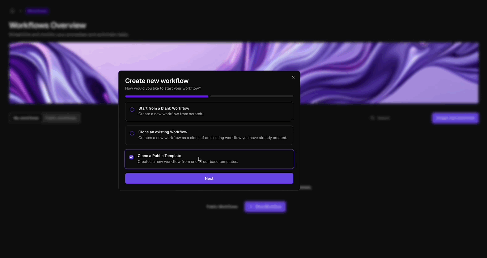
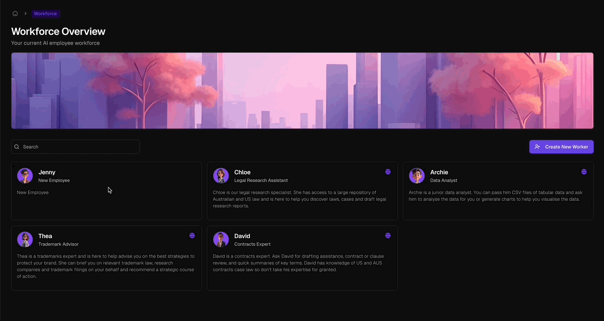

import { Callout, Card, CardGroup } from '@mintlify/components';

<Callout type="info">
  Workflows are the heart of Lawme, driving your virtual assistants and simplifying routine tasks.
</Callout>

<Frame className="block dark:hidden">
  
</Frame>
<Frame className="hidden dark:block">
  
</Frame>

<CardGroup cols={2}>
  <Card title="Automate Tasks" icon="robot">
    Streamline repetitive processes and increase efficiency in your organization.
  </Card>
  <Card title="Empower Virtual Assistants" icon="user-gear">
    Enable your AI assistants to handle complex workflows with precision.
  </Card>
</CardGroup>

Workflows are like digital roadmaps that guide your virtual assistants through various tasks. They automate everything from research to document drafting, freeing up your team to focus on high-value work. Each assistant in Lawme can use both ready-made workflows for common tasks and custom workflows designed specifically for your organization.

## The Importance of Workflows

Workflows are essential to your operations in Lawme. They handle repetitive tasks, ensure consistency, and enable your assistants to respond quickly and accurately.

<CardGroup cols={2}>
  <Card title="Non-Stop Efficiency" icon="clock">
    Your workflows work around the clock, keeping your organization's operations moving 24/7.
  </Card>
  <Card title="Versatile Options" icon="gear">
    Choose from ready-made workflows for standard tasks or create custom ones tailored to your organization's unique processes.
  </Card>
</CardGroup>

## Creating Your Workflows

<Frame className="block dark:hidden">
  
</Frame>
<Frame className="hidden dark:block">
  
</Frame>

Lawme offers flexible options for setting up workflows:

1. **Ready-to-Use Workflows**  
   Start with our library of pre-built workflows for common tasks. These workflows provide immediate benefits by automating tasks like research, compliance checks, and document creation.

2. **Customized Workflows**  
   Tailor workflows to your organization's specific needs. Our user-friendly Workflow Builder lets you design workflows from scratch, incorporating your own templates, documents, and requirements.

## Managing Your Workflows

<CardGroup cols={2}>
  <Card title="Start a New Workflow" icon="plus">
    Click **New Workflow** in the Workflows dashboard to begin creating a new process.
  </Card>
  <Card title="Name and Describe" icon="pen-to-square">
    Provide a clear name and detailed description for your workflow in the **Workflow Info** section.
  </Card>
  <Card title="Design Your Process" icon="diagram-project">
    Add and arrange blocks in the workflow canvas to define your custom process.
  </Card>
  <Card title="Configure and Connect" icon="sliders">
    Set up each block's parameters and establish connections between steps for a seamless flow.
  </Card>
  <Card title="Test and Refine" icon="vial">
    Run test scenarios to ensure your workflow functions as intended, and make adjustments as needed.
  </Card>
  <Card title="Save and Publish" icon="floppy-disk">
    Save your work and publish the workflow to make it available for your virtual assistants.
  </Card>
</CardGroup>

## Connecting Workflows to Assistants

<Frame className="block dark:hidden">
  
</Frame>
<Frame className="hidden dark:block">
  
</Frame>

Workflows are attached to virtual employees through their application configuration, enabling them to intelligently execute tasks during communication:

<Info>
  Workflows function as business processes you've taught your virtual employees. They use these processes to handle tasks like drafting documents, conducting research, or managing inquiries, ensuring consistency with your organization's specific requirements and standards.
</Info>

## Workflows in Practice

Lawme's workflows are dynamic tools that enhance your organization's operations:

- **Intelligent Process Execution**: Virtual employees can automatically select and run appropriate workflows in response to specific communication contexts or requests.
- **Seamless Integration**: Workflows are seamlessly integrated into the employee's knowledge base, allowing them to access and apply relevant information during task execution.
- **Adaptive Learning**: As workflows are refined and updated, virtual employees adapt their responses, continuously improving their performance and accuracy.
- **Customized Responses**: Employees can combine multiple workflows or parts of workflows to create tailored solutions for complex inquiries or tasks.