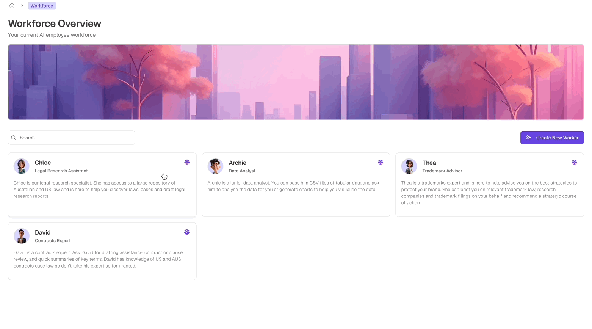
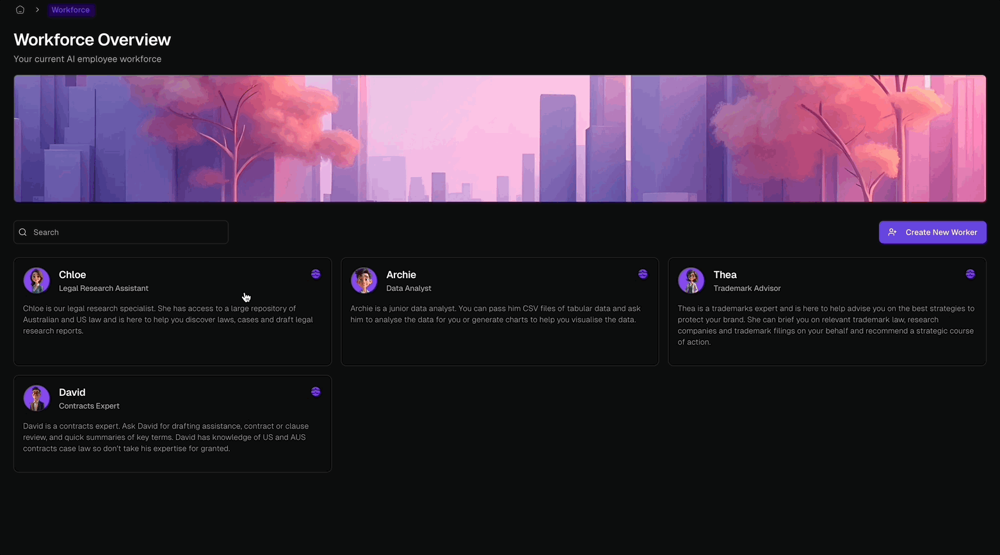
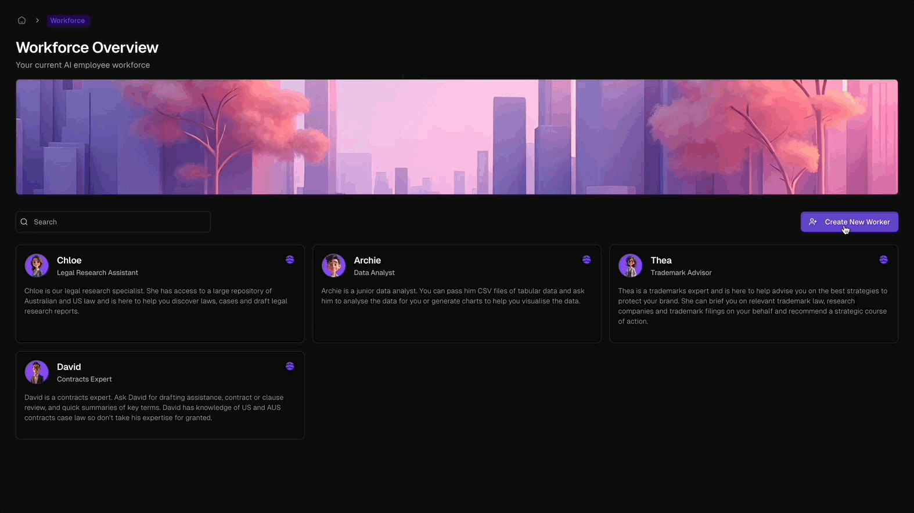
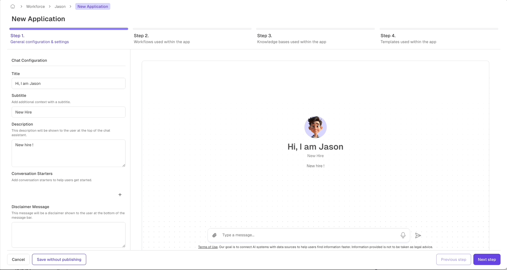

<Note>
  Odella's virtual workforce allows your team to focus on delivering superior insights and client outcomes while AI assistants handle day-to-day operations.
</Note>

## Workforce Overview

<Frame>
  
  
</Frame>

Empower your organisation with a 24/7 virtual team designed to manage routine tasks. Our virtual assistants are trained to handle day-to-day operations, improving service without the need for additional hires.

<CardGroup cols={2}>
  <Card title="Free Up Your Team" icon="user-tie">
    Allow your team to focus on strategic challenges while AI handles routine tasks.
  </Card>
  <Card title="Cost-Effective Scaling" icon="chart-line">
    Expand your organisation's capacity without the overheads of hiring and training new staff.
  </Card>
  <Card title="24/7 Availability" icon="clock">
    Respond quickly to needs and meet deadlines with round-the-clock support.
  </Card>
  <Card title="Tailored Assistance" icon="sliders">
    Customise AI assistants to align with your organisation's specific processes and data.
  </Card>
</CardGroup>

## Onboarding New Assistants

<Frame>
  
  
</Frame>

Follow these steps to expand your virtual team:

1. Navigate to the **Workforce Overview** page and click **"Create New Worker"**.
2. Fill out the **Add New Employee** form:
   - **Avatar**: Select for easy visual identification.
   - **Name**: Choose a name reflecting the assistant's role (e.g., "Research Assistant").
   - **Role**: Assign a specific role such as Data Analyst or Customer Support.
   - **Description**: Provide a brief description of managed tasks.
3. Click **"Save Assistant"** to create your new virtual assistant.
4. The new assistant will appear on the **Workforce Overview** page.
5. Click on the assistant to view details and manage settings.

<Tip>
  **Best Practices for Creating Effective Assistants:**
  - Define clear, specific roles for each assistant
  - Use descriptive names for easy identification
  - Leverage avatars as visual cues to distinguish between assistants
</Tip>

## Applications and Integration

Each virtual assistant can be connected to different communication methods:

<CardGroup cols={2}>
  <Card title="Chat Assistant" icon="comments">
    Web-based chat for direct interaction
  </Card>
  <Card title="Email Integration" icon="envelope">
    Assign an email account for email communication
  </Card>
  <Card title="Slack Bot" icon="slack">
    Integrate into Slack for team workspace interaction
  </Card>
</CardGroup>

### Setting Up Applications

<Frame>
  
  
</Frame>

1. Navigate to the assistant's profile and select from **Applications to setup**
2. **Application Type**: Choose and set up workflows specific to your application.
3. **Knowledge Bases**: Integrate knowledge sources relevant to your app.
4. **Templates**: Customise templates for common responses or layouts.
5. **Review and Publish**: Check your setup, then click **"Publish"** to go live.

<Warning>
  Ensure clear workflow titles for accurate AI task matching and equip applications with appropriate tools for optimal performance.
</Warning>

By utilising Odella's virtual workforce, you can focus on providing high-quality services while efficiently managing routine tasks. Start building your AI-powered team today!