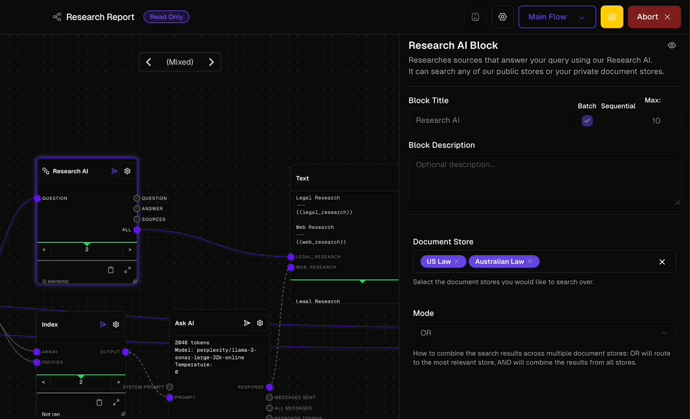
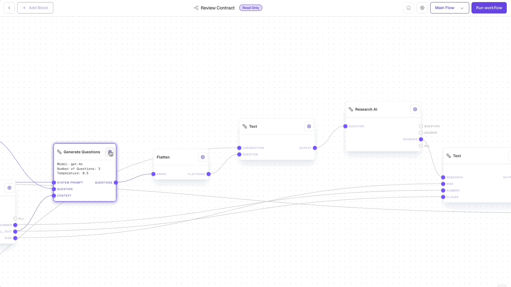
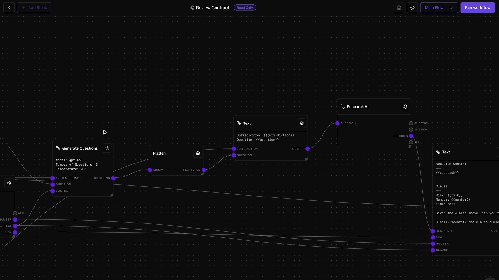

<Callout type="info">
  Batching lets you handle multiple documents or tasks at the same time, similar to having multiple assistants working in parallel.
</Callout>

## What is Batching?

<Frame className="block dark:hidden">
  
</Frame>
<Frame className="hidden dark:block">
  
</Frame>

Think of batching like having multiple assistants working on similar tasks simultaneously. For example, instead of reviewing 10 contracts one after another, batching allows you to have 10 reviews happening at the same time. This makes your workflow much faster.

To use batching in Lawme, you simply:

<Steps>
  1. Select any block in your workflow that you want to run multiple times
  2. Look for the "Batch" option in the block's settings
  3. Turn it on to enable parallel processing
</Steps>

## How Batching Makes Your Work Easier

Here's what happens when you use batching:

<Card title="Parallel Processing" icon="clone">
  Instead of processing documents one at a time, Lawme works on multiple documents simultaneously - like having a team of paralegals instead of just one.
</Card>

<Card title="Automatic Organization" icon="arrows-left-right">
  Lawme keeps track of all the documents being processed and organizes the results for you automatically.
</Card>

## When Should You Use Batching?

Batching is particularly useful in the following scenarios:

<CardGroup cols={2}>
  <Card title="High Volume Processing" icon="layer-group">
    When you have multiple items (documents, questions, cases) that need the same type of processing
  </Card>
  <Card title="Repetitive Tasks" icon="rotate">
    For tasks that are repetitive and follow a standard process without needing custom handling
  </Card>
  <Card title="Consistency Requirements" icon="equals">
    When you need uniform output across multiple items, like standardized document formatting or response structures
  </Card>
  <Card title="Speed Priority" icon="bolt">
    In time-sensitive situations where processing items individually would create unacceptable delays
  </Card>
  <Card title="Scalable Workflows" icon="arrow-up-right-dots">
    For processes that may need to scale up, such as handling multiple jurisdictions or growing document volumes
  </Card>
  <Card title="Resource Optimization" icon="chart-line">
    When you want to maximize efficiency by parallel processing instead of sequential handling
  </Card>
</CardGroup>

## Creating Workflows with Batching

<Frame className="block dark:hidden">
  
</Frame>
<Frame className="hidden dark:block">
  
</Frame>

When designing workflows that use batching, keep these tips in mind:

<CardGroup cols={2}>
  <Card title="Input Structure" icon="arrow-right-to-bracket">
    Ensure your input block provides an array or list of items to be processed. Each item will be processed in parallel when it reaches a batched block.
  </Card>
  <Card title="Output Handling" icon="arrow-right-from-bracket">
    Remember that batched blocks will output arrays of results. Structure your subsequent blocks to handle multiple results appropriately.
  </Card>
</CardGroup>

<Steps>
  1. Start with an Input Block that accepts multiple items
  2. Connect to blocks where parallel processing makes sense
  3. Enable batching on those blocks through their settings
  4. Add blocks to handle the batched outputs
  5. Test with a small batch first to ensure correct processing
</Steps>

<Tip>
  Use the "If" block after batched operations to process results conditionally. For example, you might want to handle successful and failed items differently.
</Tip>

## Real-World Example

Here's a practical example of how batching works:

<Steps>
  1. You have 20 contracts that need review
  2. Set up a workflow with batching enabled
  3. Upload all 20 contracts at once
  4. Lawme processes all contracts simultaneously
  5. Receive organized results for all contracts
</Steps>

What would have taken hours to process sequentially can now be completed in a fraction of the time!

<Warning>
  While batching is powerful, remember that you can't batch a batch (no nesting). If you need more complex processing, consider using a Subflow Block with batching enabled.
</Warning>

Think of batching as your virtual team of assistants, working together to complete your legal tasks more efficiently. It's one of the easiest ways to multiply your productivity in Lawme.
