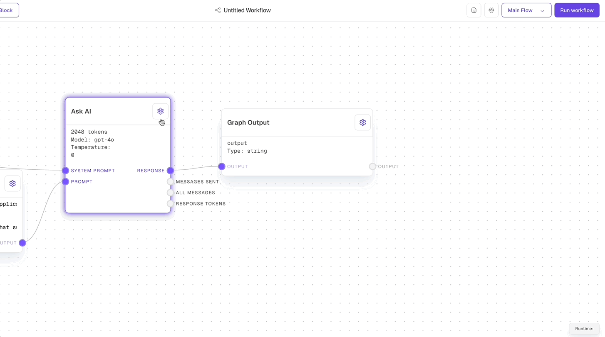
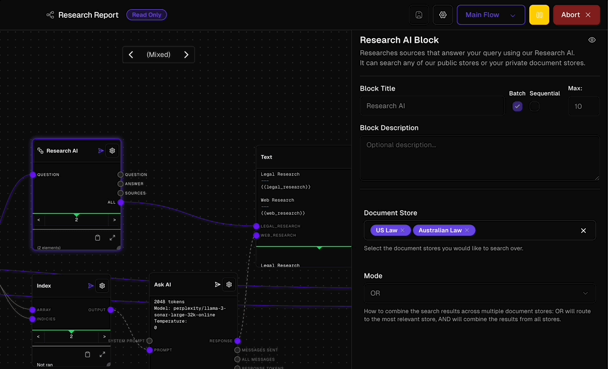
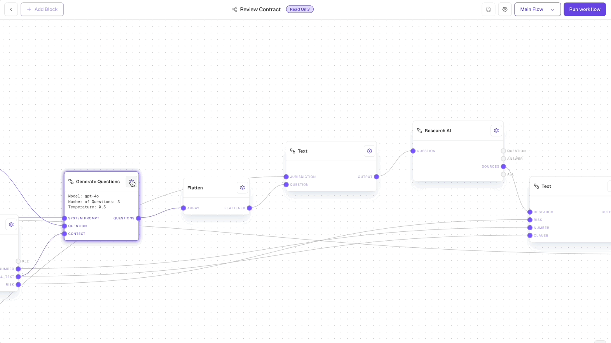
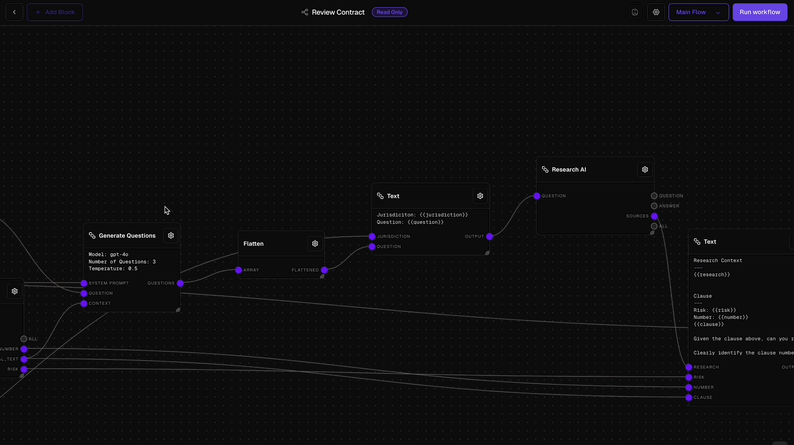

# Process independent items concurrently

Batching runs the same block once for each item in a collection. Use it when items are independent and can be processed concurrently.

<Frame>
  
  
</Frame>

## When to use batching

Good candidates include:

- Extracting the same fields from multiple documents
- Classifying a list of requests
- Applying one validation to every record
- Creating a draft result for each independent item

Use a loop instead when items must run in sequence, share mutable state, or depend on the previous result.

## Enable batching

<Steps>
  <Step title="Provide a collection">
    Connect an array or table containing the items to process.
  </Step>
  <Step title="Select the processing block">
    Open the block's settings and enable batching where supported.
  </Step>
  <Step title="Configure the item input">
    Confirm which value from the collection is passed to each block execution.
  </Step>
  <Step title="Handle collected output">
    A batched block returns a collection of results. Connect it only to downstream blocks that can handle that type.
  </Step>
  <Step title="Test a small batch">
    Verify ordering, result shape, and failure behavior before increasing volume.
  </Step>
</Steps>

<Frame>
  
  
</Frame>

## Result handling

Decide how the workflow should behave when one item fails:

- Stop the full run
- Return successful and failed items separately
- Retry eligible failures
- Send failures for human review

Do not treat a partially successful batch as fully complete unless the downstream process explicitly supports that outcome.

## Capacity and external systems

Concurrent work can increase load on models and connected applications. Consider:

- Provider rate limits
- API quotas
- File and payload size
- Duplicate writes
- Ordering requirements
- Downstream concurrency limits
- Usage-based charges

Start with a small representative batch and increase volume only after observing reliable behavior.

## Limitations

Nested batching is not supported. If a process needs multiple layers of collection handling, simplify the data shape, use a subflow, or process one layer sequentially.

## Batching checklist

- Items are independent.
- Input is an array or compatible collection.
- Downstream blocks expect a collection.
- Partial failures have a defined outcome.
- External rate limits are understood.
- Duplicate external actions are prevented.
- Representative volume has been tested.

See [Batching tutorial](/workflow-tutorial/05-batching) for a guided example.
