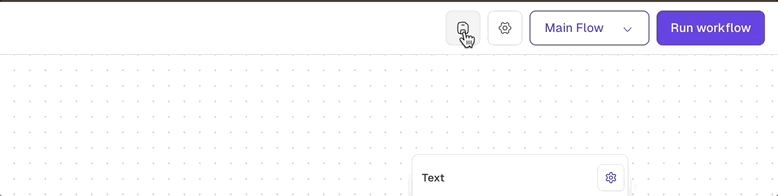
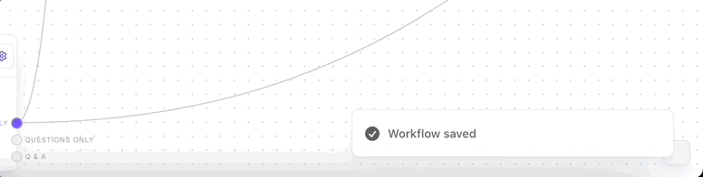

import { Callout, Card, CardGroup, Steps, Step, Tip } from '@mintlify/components';

## Key Interface Components

Lawme's workflow interface is designed to be intuitive yet powerful, allowing you to create complex legal workflows with ease. Let's explore the main components:

<CardGroup cols={2}>
  <Card
    title="Sidebar"
    icon="sidebar"
    image="/images/sidebar.png"
  >
    Navigate between projects, flows, and access essential configuration options.
  </Card>
  <Card
    title="Flow Canvas"
    icon="diagram-project"
    image="/images/flow-canvas.png"
  >
    The main workspace where you design and visualise your legal workflows.
  </Card>
  <Card
    title="Block Editor"
    icon="pen-to-square"
    image="/images/block-editor.png"
  >
    Customise individual blocks to fine-tune your workflow's behaviour.
  </Card>
  <Card
    title="Action Bar"
    icon="play"
    image="/images/action-bar.png"
  >
    Control the execution of your workflows and access additional features.
  </Card>
</CardGroup>

## Saving Your Work

Saving your work in Lawme is crucial to ensure that all your changes are preserved. Here's what you need to know about saving:

<CardGroup cols={2}>
  <Card
    title="Auto-Save"
    icon="clock"
  >
    Lawme automatically saves your work every few minutes to prevent data loss.
  </Card>
  <Card
    title="Manual Save"
    icon="floppy-disk"
  >
    You can manually save at any time by pressing Ctrl+S (Windows) or Cmd+S (Mac).
  </Card>
</CardGroup>

<Callout type="info">
  It's a good practice to manually save your work after making significant changes to your workflow.
</Callout>

### Save Indicators

Lawme provides visual indicators to show the save status of your work:

- A green checkmark indicates that all changes have been saved.
- A spinning icon indicates that changes are being saved.
- A red exclamation mark indicates that there are unsaved changes.

<Tip>
  Always ensure your work is saved before closing the browser or logging out. If you see the red exclamation mark, make sure to manually save your changes.
</Tip>

## Sidebar

The sidebar is your central navigation hub, offering quick access to project information, flows, and flow-specific details.

### General Tab

The General tab allows you to set basic information about your workflow:

- **Workflow Name**: Set a clear, descriptive name for your workflow.
- **Workflow Description**: Provide a concise overview of your workflow's purpose and scope.

<Tip>
  A well-documented project makes collaboration easier and helps you quickly identify the right workflow when you need it.
</Tip>

### Flows Tab

The Flows tab is where you manage your workflow components:

- **Main Flow**: The primary, undeletable flow of your workflow.
- **Flow Explorer**: Click on any flow to view and edit it.
- **Add Flow**: Click the "+" icon to create a new flow.
- **Rename Flow**: Use the pencil icon to edit a flow's name and description.
- **Delete Flow**: Remove a flow with the trash icon. Note: This action is irreversible.

Use this tab to organize and structure your legal workflow efficiently.

<Callout type="warning">
  Deleting a flow is permanent and cannot be undone. Always ensure you have a backup of your workflow before making significant changes.
</Callout>

### Plugins Tab

The Plugins tab allows you to integrate external services and extend the functionality of your workflows:

Currently available plugins include:

- **G-Mail**: Draft, send and search for e-mails in your workflows using G-Mail.
- **Hubspot**: Search your Hubspot CRM for contacts and companies.
- **Google Drive**: Access files in your Google Drive for use in our template builder and within your workflows.

<Tip>
  Connecting plugins enhances your workflow capabilities by allowing seamless integration with external tools and services you already use.
</Tip>

### Builder Tab

The Builder tab provides settings to customize your workflow environment:

- **Previous data per node to keep**: Set the number of previous data values to retain for each node. This helps in tracking the history of node operations.
- **Zoom sensitivity**: Adjust the sensitivity of zooming when using the mouse wheel. Move the slider towards "Slow" for finer control or "Fast" for quicker zooming.

<Tip>
  Experiment with these settings to find the optimal configuration for your workflow management style. Adjusting the zoom sensitivity can greatly improve your navigation experience on the canvas.
</Tip>

### Delete Workflow

The Delete Workflow tab allows you to permanently remove a workflow and all its associated data:

To delete a workflow:

1. Click the **"Delete workflow"** button in the sidebar to open the deletion interface.
2. To prevent accidental deletions, you must **type the exact name** of the workflow you wish to delete in the text field (e.g., "Delete New test workflow").
3. The delete button will become **active** once the correct name is entered.
4. Click the **"Delete New test workflow"** button to permanently remove the workflow.

<Callout type="warning">
  **Deleting a workflow is irreversible.** Ensure you have backups of any important data before proceeding with deletion.
</Callout>

## Flow Canvas

The Flow Canvas is where your legal workflows come to life. Here's how to navigate and use this powerful space:

- **Pan**: Click and drag to move around the canvas.
- **Zoom**: Use the scroll wheel to zoom in and out.
- **Add Blocks**: Right-click to open the context menu and add new blocks.
- **Select Multiple Blocks**: Hold Shift and drag to create a selection box, or Shift-click block title bars.
- **Group Operations**: Move selected blocks as a group or create subflows from selections.

## Block Editor

Customise your workflow blocks with the Block Editor:

<CardGroup cols={2}>
  <Card
    title="Block Details"
    icon="pen"
  >
    Edit block titles and descriptions for clear documentation.
  </Card>
  <Card
    title="Batching"
    icon="layer-group"
  >
    Enable batch processing and set maximum batch amounts for efficiency.
  </Card>
  <Card
    title="Variants"
    icon="code-branch"
  >
    Create and switch between different versions of a block to test variations.
  </Card>
  <Card
    title="Block-Specific Editors"
    icon="sliders"
  >
    Access specialised editors tailored to each block type.
  </Card>
</CardGroup>

## Action Bar

Control your workflow execution and access additional features:

<CardGroup cols={4}>
  <Card
    title="Run"
    icon="play"
  >
    Start executing the current flow.
  </Card>
  <Card
    title="Abort"
    icon="stop"
  >
    Immediately stop the running flow.
  </Card>
  <Card
    title="Pause/Resume"
    icon="pause"
  >
    Temporarily halt or continue flow execution.
  </Card>
  <Card
    title="Settings"
    icon="gear"
  >
    Access additional Lawme features and settings.
  </Card>
</CardGroup>

<Tip>
  Experiment with different components of the interface to find the most efficient workflow for your legal tasks. The flexibility of Lawme's interface allows you to tailor your experience to your specific needs.
</Tip>
