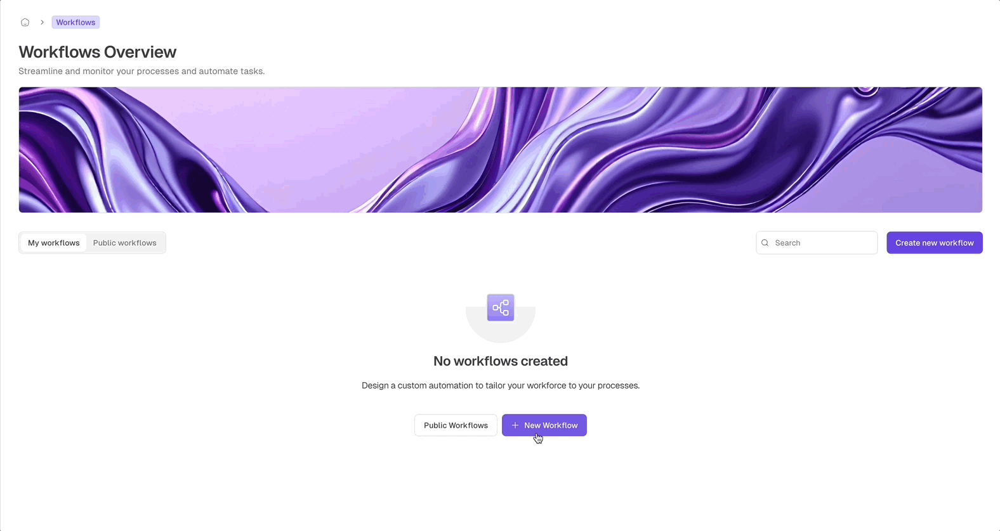
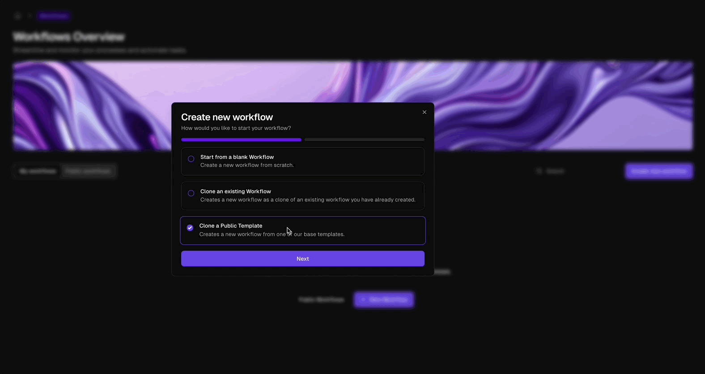
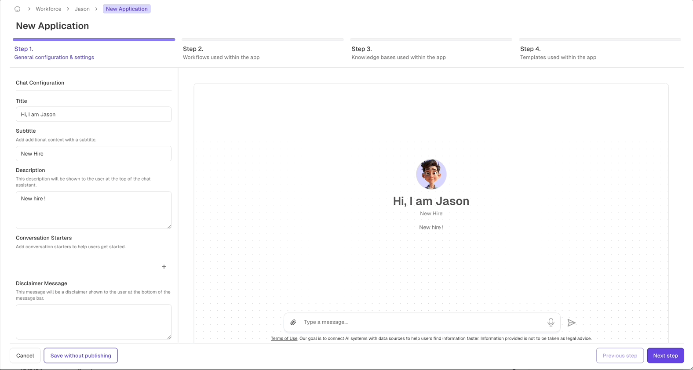
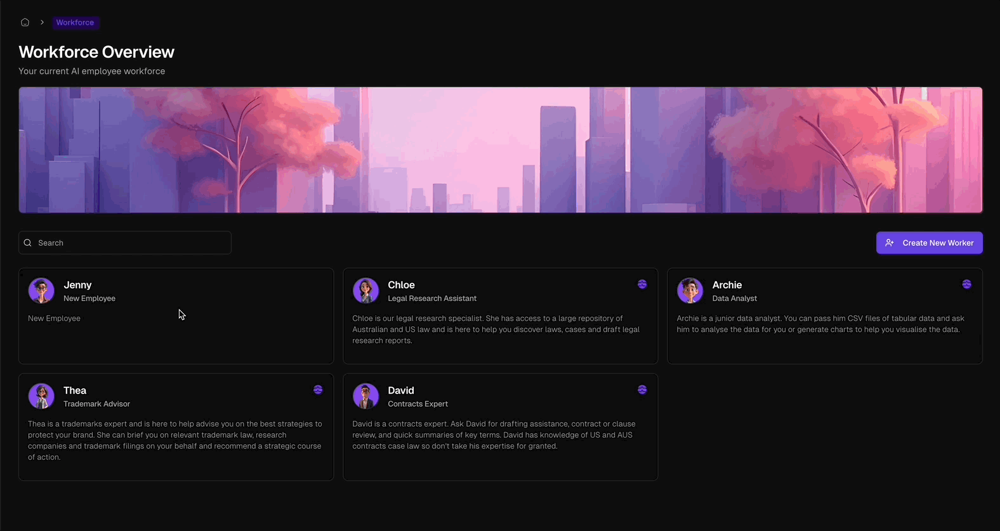

## Harness the Power of Workflow Automation

Workflows are the process engine behind Odella. They give your AI employees repeatable steps for research, document drafting, data extraction, approvals, integrations, and other operational tasks.

<Frame>
  
  
</Frame>

<CardGroup cols={2}>
  <Card title="Automate Tasks" icon="robot">
    Turn repeatable work into structured processes that run consistently every time.
  </Card>
  <Card title="Power AI Employees" icon="user-gear">
    Give AI employees the workflows they need to execute tasks accurately from delegated requests.
  </Card>
  <Card title="Visual Workflow Canvas" icon="paintbrush">
    Design processes with a visual builder that connects actions, logic, data, and AI blocks.
  </Card>
  <Card title="Live Debugging" icon="bug">
    Monitor workflows as they run and inspect each step to refine performance and reliability.
  </Card>
</CardGroup>

## How Workflows Fit Into Odella

Workflows are like digital roadmaps. They guide AI employees through tasks from start to finish, ensuring the right information is gathered, the right logic is applied, and the right output is produced.

Each AI employee can use:

- **Ready-made workflows** for common tasks
- **Custom workflows** designed around your organization's process
- **Templates** for document generation
- **Documents and knowledge bases** for context and precedent
- **Integrations** for connected tools and systems

## Creating Workflows

<Frame>
  
  
</Frame>

<Steps>
  <Step title="Start a New Workflow">
    Click **New Workflow** in the Workflows dashboard to begin creating a process.
  </Step>
  <Step title="Name and Describe the Workflow">
    Provide a clear name and description so team members and AI employees understand when the workflow should be used.
  </Step>
  <Step title="Design the Process">
    Add and arrange blocks in the workflow canvas to define each step of the task.
  </Step>
  <Step title="Configure and Connect Blocks">
    Set block inputs, outputs, and connections so data flows correctly through the workflow.
  </Step>
  <Step title="Test and Refine">
    Run the workflow, inspect outputs, debug issues, and adjust the process until it works reliably.
  </Step>
  <Step title="Save and Publish">
    Save the workflow and make it available to the AI employees that should be able to use it.
  </Step>
</Steps>

## Connecting Workflows to AI Employees

<Frame>
  
  
</Frame>

Workflows are attached to AI employees through their application configuration. Once connected, employees can select and run appropriate workflows when they receive a delegated task.

<Info>
  Workflows function as business processes you've taught your AI employees. Clear workflow names and descriptions help employees choose the right process for each request.
</Info>

## Workflow Building Blocks

<CardGroup cols={2}>
  <Card title="Smart Blocks" icon="wand-magic-sparkles">
    Use preconfigured actions for AI reasoning, data transformation, document work, integrations, and control flow.
  </Card>
  <Card title="Logic and Branching" icon="diagram-project">
    Add conditionals, matching, loops, batching, and subflows to model complex processes.
  </Card>
  <Card title="AI Orchestration" icon="microchip-ai">
    Coordinate multiple AI steps and models within a single workflow.
  </Card>
  <Card title="Operational Consistency" icon="shield-check">
    Standardize how tasks are completed so output follows your organization's process and precedent.
  </Card>
</CardGroup>

<Callout type="warning" emoji="⚖️">
  Workflows are designed to enhance your team's expertise, not replace review. Always validate outputs for business-critical work.
</Callout>
