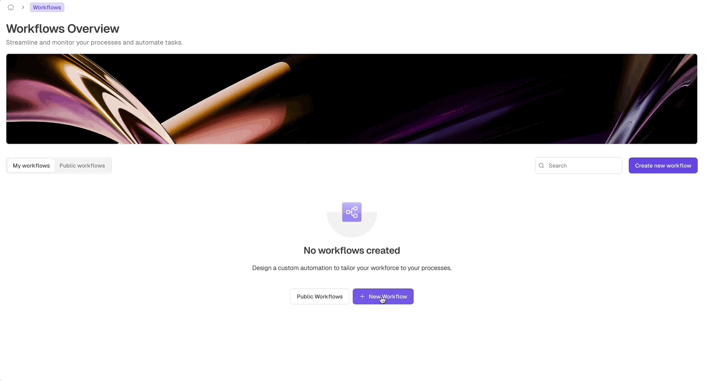
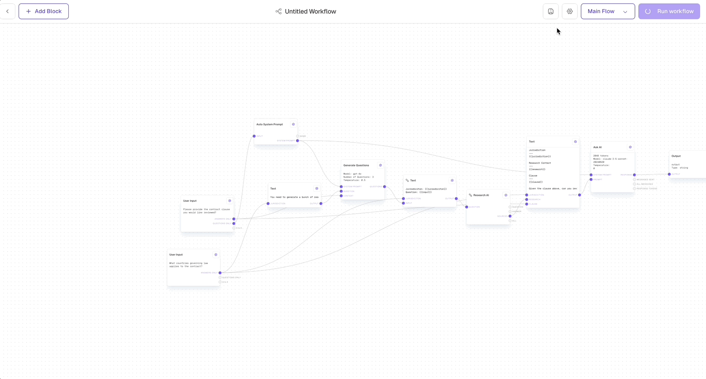
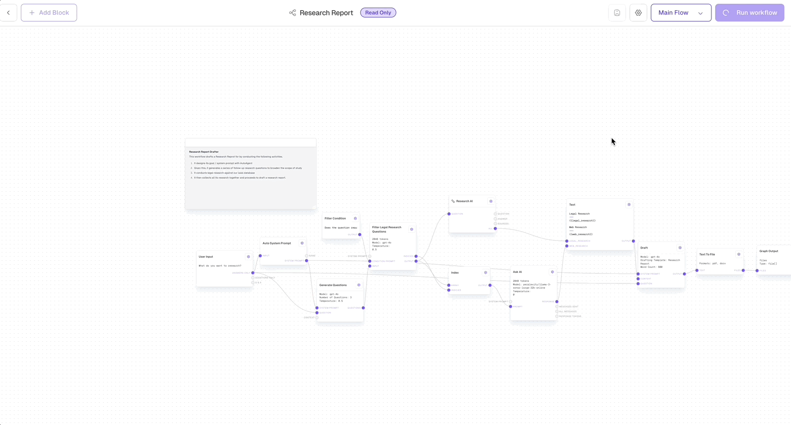

import { Callout, Card, CardGroup, Steps, Tip, Warning } from '@mintlify/components';

<Callout type="info">
  Flows are the cornerstone of Lawme, representing sophisticated business processes and AI-powered workflows that revolutionise legal task automation.
</Callout>

A Lawme project is a collection of multiple flows. Each flow serves as a visual representation of a legal task or process, constructed using interconnected blocks that collaborate to achieve specific outcomes.

## Understanding Flows

Flows in Lawme are designed to streamline and accelerate your legal work. They function as a chain of intelligent building blocks, with each block performing a specialised task. Information cascades through these blocks from left to right, enabling you to craft smart, AI-powered workflows without any coding expertise.

Here's a simplified model of how a flow operates:

1. It initiates with "starter" blocks that require no input to begin.
2. As each block completes its task, it transmits its results to the subsequent connected blocks.
3. A block remains dormant until it receives all necessary information to commence its operation.
4. This process continues, with some blocks operating concurrently when possible, until the entire flow reaches completion.

This architecture allows for the creation of sophisticated AI workflows, where the output of one AI task becomes the catalyst for the next, facilitating intelligent decision-making and automatic task completion.

## Creating a New Workflow

<Frame>
  
</Frame>

<Steps>
  <Step title="Initiate Workflow Creation">
    Click the "Create new workflow" button in the top right corner of the Workflows Overview page.
  </Step>
  <Step title="Choose Workflow Type">
    In the new window, select from one of three options:
    - "Start from a blank Workflow" to create a new workflow from scratch
    - "Clone an existing Workflow" to create a copy of a workflow you've already made
    - "Clone a Public Template" to begin with one of our pre-built base templates
  </Step>
  <Step title="Configure Workflow Details">
    Provide essential information such as name and description for your workflow.
  </Step>
  <Step title="Access Workflow Editor">
    Click "Next" to proceed to the workflow editor.
  </Step>
  <Step title="Begin Building">
    Click "Start building" to commence creating your new workflow.
  </Step>
</Steps>

Your newly created workflow will now appear in the "My workflows" list on the Workflows Overview page, ready for you to start constructing your AI-powered process.

## Removing a Flow

<Warning>
  Deleting a flow is an irreversible action. Please exercise caution and ensure you want to proceed before deletion.
</Warning>

<Frame>
  
</Frame>

1. Navigate to the card representing the workflow you wish to delete.
2. Click on the workflow to open its details.
3. On the workflow screen, locate and click the settings icon (typically a cog or gear symbol).
4. In the settings menu, find and select the 'Delete Workflow' option.
5. Confirm the deletion, acknowledging that this action will permanently remove the workflow and all associated data.

## Starting a Flow

<Frame>
  
</Frame>

<Card title="Executing Your Workflow" icon="play">
  To run the currently selected flow, click the **Run** button located in the top right corner of the workflow page. You can observe the flow's execution in real-time, monitoring how data traverses through your AI chain.
</Card>

## Flow Inputs and Outputs

Flows in Lawme are designed as a graph-like structure, where inputs and outputs are determined by specific blocks within the workflow. This approach enhances flexibility and reusability across various scenarios.

### Flow Structure

<Card title="Graph-like Design" icon="diagram-project">
  Flows are composed of interconnected blocks, forming a directed graph where data flows from inputs to outputs through various processing steps.
</Card>

### Inputs

<CardGroup cols={2}>
  <Card title="Input Blocks" icon="arrow-right-to-bracket">
    [Input Blocks](../../block-reference/input) serve as entry points for data in your flow. They define the parameters your workflow requires to run.
  </Card>
  <Card title="Multiple Inputs" icon="layer-group">
    Flows can have multiple input blocks, allowing for complex data ingestion scenarios.
  </Card>
</CardGroup>

### Outputs

<CardGroup cols={2}>
  <Card title="Output Blocks" icon="arrow-right-from-bracket">
    [Output Blocks](../../block-reference/output) define the results your flow returns upon completion. They act as exit points for processed data.
  </Card>
  <Card title="Multiple Outputs" icon="share-nodes">
    Flows can have multiple output blocks, enabling diverse result structures.
  </Card>
</CardGroup>

### Data Flow

Data traverses through the workflow, being transformed and processed by various blocks before reaching the output. The graph-like structure allows for:

- Parallel processing
- Conditional branching
- Data aggregation and splitting

This flexible architecture enables the creation of complex, powerful workflows tailored to specific legal tasks and processes.

<Tip>
  When designing flows, consider the critical information your workflow needs (inputs) and the valuable insights or actions it should generate (outputs).
</Tip>

## Best Practices for Designing Flows

<CardGroup cols={2}>
  <Card title="Start Simple" icon="seedling">
    Begin with a basic workflow and incrementally introduce complexity as needed.
  </Card>
  <Card title="Use Descriptive Names" icon="tag">
    Assign clear, meaningful names to your flows and blocks that reflect their purpose.
  </Card>
  <Card title="Document Your Flow" icon="book">
    Utilise comments or documentation blocks to elucidate the purpose and logic of your workflow.
  </Card>
  <Card title="Test Thoroughly" icon="vial">
    Leverage the live debugging feature to ensure your flow behaves as expected with various inputs.
  </Card>
</CardGroup>

By mastering flows in Lawme, you'll be equipped to create powerful, AI-driven workflows that automate complex legal tasks and significantly enhance your firm's efficiency.
