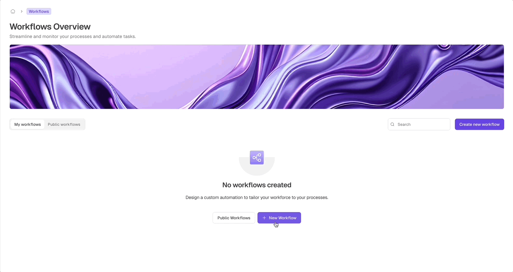
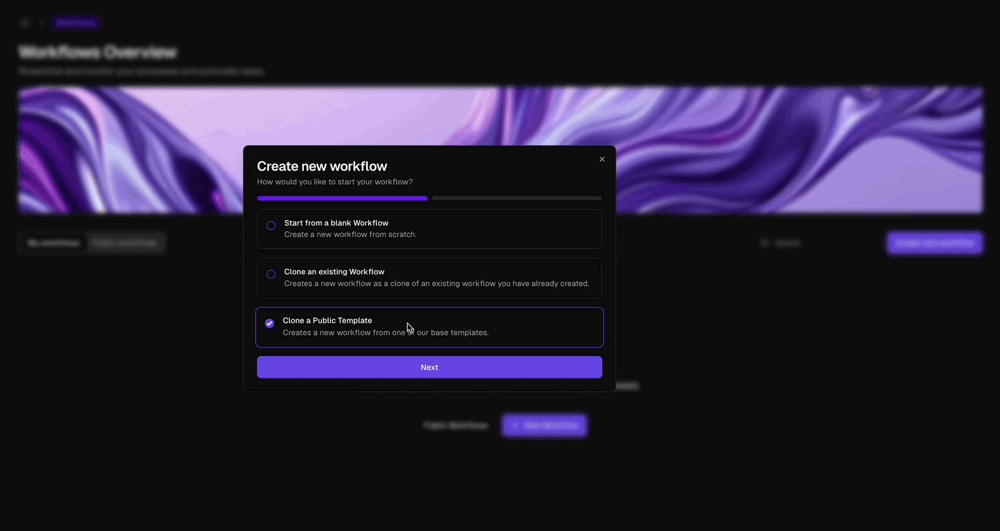
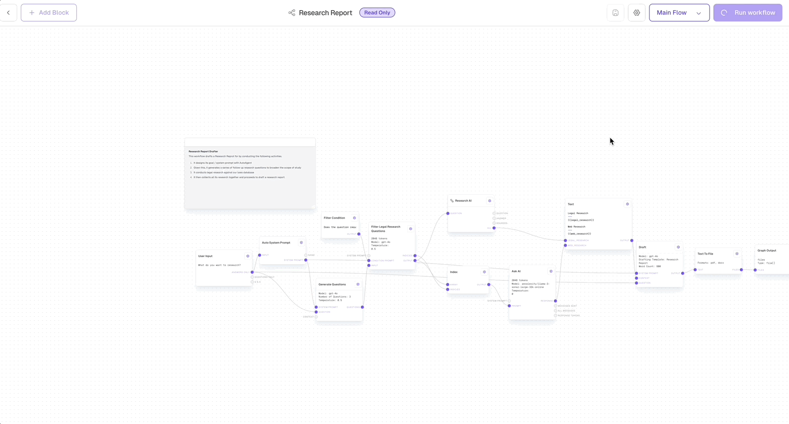
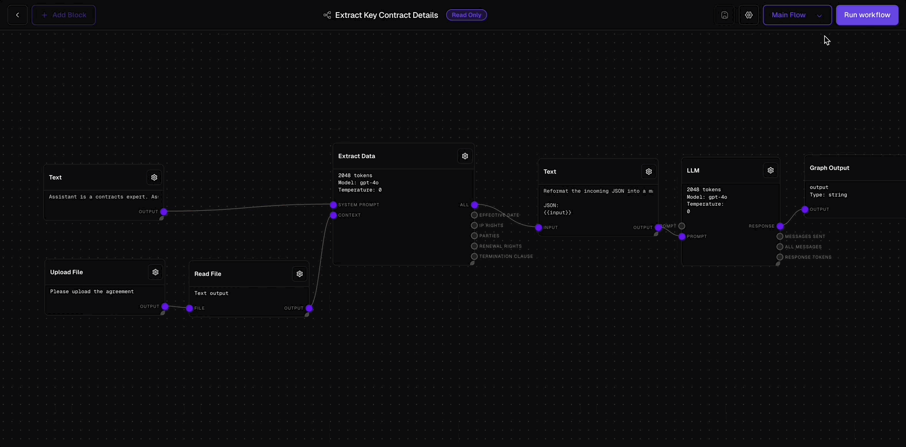
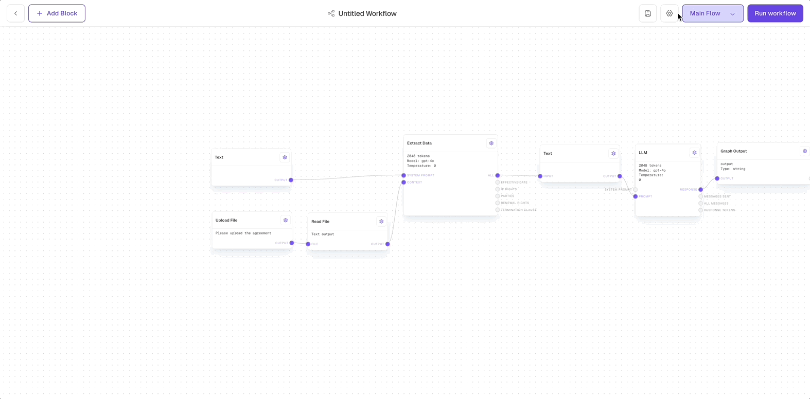
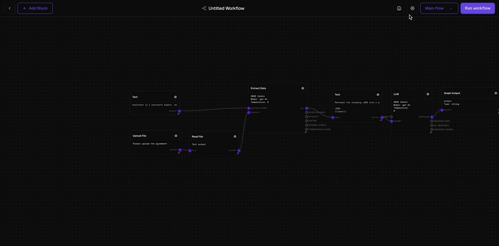

# Manage workflows

A workflow is a directed graph of connected blocks. Each block waits for its required inputs, performs one operation, and passes output to downstream blocks. Independent branches can run concurrently.

## Create a workflow

<Frame>
  
  
</Frame>

<Steps>
  <Step title="Select New Workflow">
    Open Workflows and select **New Workflow**.
  </Step>
  <Step title="Choose a starting point">
    Start blank, clone an existing workflow, or use a Marketplace workflow.
  </Step>
  <Step title="Name the workflow">
    Use an outcome-focused name and describe when the workflow should run and what it returns.
  </Step>
  <Step title="Build on the canvas">
    Add blocks, connect compatible ports, and configure each step.
  </Step>
</Steps>

## Define inputs and outputs

A reusable workflow should have an explicit interface.

<CardGroup cols={2}>
  <Card title="Flow Input" icon="arrow-right-to-bracket" href="/block-reference/io/graph-input">
    Define each value required to start the workflow, including its name, type, and default where appropriate.
  </Card>
  <Card title="Flow Output" icon="arrow-right-from-bracket" href="/block-reference/io/graph-output">
    Define the values returned to the caller when the workflow completes.
  </Card>
</CardGroup>

Use business-meaningful names and validate required values before expensive or irreversible steps run.

## Run and inspect a workflow

<Frame>
  
  
</Frame>

Select **Run**, provide any required input, and follow execution on the canvas. Inspect block outputs to identify where actual behavior first differs from the expected result.

Test at least:

- A normal case
- Missing required input
- Invalid input
- Boundary values
- Every conditional branch
- A connected-application failure
- A partial batch failure, when applicable

See [Live debugging](/workflow/live-debugging) for run inspection.

## Save and publish

Saving preserves draft changes. Publishing makes the tested version available for production use and worker assignment.

Before publishing:

1. Confirm the workflow owner and intended callers.
2. Review inputs, outputs, permissions, and approvals.
3. Test representative and failure cases.
4. Confirm that the name and description match actual behavior.
5. Document important assumptions with Comment blocks.

## Update a published workflow

Treat changes to inputs, outputs, connected applications, and shared subflows as compatibility changes. Identify dependent workers and workflows, test them against the update, and communicate material behavior changes to process owners.

## Delete a workflow

<Frame>
  
  
</Frame>

<Warning>
  Deleting a workflow is permanent. Before deletion, remove or replace references from workers, actions, schedules, and other workflows.
</Warning>

Open the workflow settings, select **Delete Workflow**, and complete the confirmation step.

## Maintenance practices

- Keep one clear business outcome per workflow.
- Use subflows for logic that is genuinely reused.
- Avoid granting broader application access than the process requires.
- Keep human approval before high-impact external actions.
- Review failed runs and stale workflows regularly.
- Retest when application schemas or business rules change.
